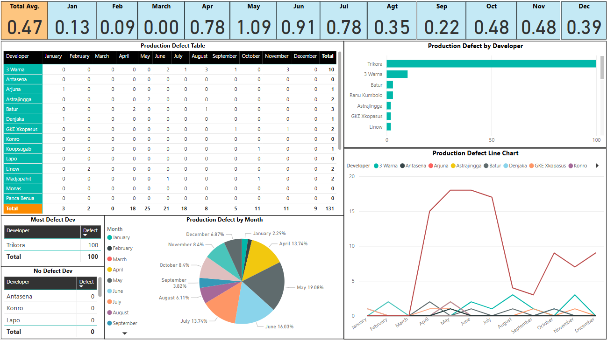

# New EBM Dashboard – PT. XL Axiata Tbk

This Power BI dashboard visualizes Engineering and Agile team performance at PT. XL Axiata Tbk through Engineering Business Metrics (EBM). It tracks real-time insights into production quality, delivery velocity, cycle time, team happiness, and Agile adoption levels across squads.

> *Disclaimer:* This project uses *dummy data*. All names have been changed, and the dataset has been modified for demonstration purposes only. It does not represent actual people or operational metrics.

---

## Objectives

The dashboard is built to provide engineering leaders, product owners, and Agile coaches with a comprehensive view of:

- How frequently teams are releasing software
- What defects are surfacing in production and where
- How long work items take to complete (cycle time)
- How distributed and overloaded developers are
- Which squads or developers are struggling or excelling
- How happy Agile team members are within their squads
- How Agile practices (Scrum, Kanban) are adopted across teams

---

## Goals

This EBM dashboard helps to:

- Increase *delivery predictability* and reduce cycle time
- Enhance *production quality* by identifying recurring defect patterns
- Improve *developer health and workload visibility*
- Guide *Agile transformation efforts* by tracking framework usage
- Support *engineering retrospectives* and OKR tracking
- Enable *data-driven decision-making* in squad allocation and sprint planning

---

## Key Insights You Can Uncover

- Who are the *top release contributors* and which teams ship the most?
- Which developers are working across too many teams?
- Which teams have *high defect rates* or rollbacks?
- How does *cycle time* vary across teams and months?
- Which Agile framework is most used: *Scrum or Kanban*?
- How is *team happiness trending* over sprints?
- Which teams or roles need more focus, support, or re-alignment?

---

## Live Demo

[View Interactive Dashboard (Power BI)](https://intip.in/productDashboard)  

---

## Offline Access

[Download the PDF version](./New%20EBM%20Dashboard%20PT.%20XL%20Axiata%20Tbk..pdf) to view the full dashboard structure offline.

---

## Preview

---

## Features

- *Defect Analytics:* Track defects by month, developer, and team
- *Release Velocity:* View monthly release activity by developer/team
- *Cycle Time Distribution:* Understand delivery pace and bottlenecks
- *Team Allocation Analysis:* Spot over-assigned developers (multi-team count)
- *Team Happiness Tracking:* Visualize morale levels and engagement
- *Agile Practice Metrics:* Count of teams using Scrum vs Kanban
- *Data Quality Checks:* View participation rates in surveys and submissions

---

## Technologies Used

- Power BI Desktop & Power BI Service
- DAX for calculated columns and measures
- Custom visuals: Word Clouds, KPI cards, matrix tables, slicers
- JSON theme formatting for consistent styling

---

## Disclaimer

This dashboard is provided for portfolio and educational purposes only.  
*The data is dummy, names have been changed*, and no actual production or personnel data is included.
